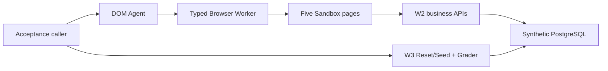

# FlowPilot Arena

> A governed enterprise computer-use agent project and a separate, synthetic
> evaluation environment.
> 面向企业级 Computer-Use Agent 与独立合成评测环境的受治理项目。

**Current status: W4 — DOM Agent Foundation.** The repository now has an
isolated Playwright Browser Worker, strict DOM/accessibility observations,
typed browser actions, and a separate bounded DOM-only ReAct loop. W3's
database-fact Grader remains the only success authority. Default tests and
Compose use a deterministic fake model with zero external cost.

## What works in W4

| Component | Current capability | Deliberately absent |
|---|---|---|
| W1 control paths | Static control web and `GET /healthz` | Tasks, DB, Agent behaviour |
| W2 Sandbox | Five manual HRIS/ITSM/IAM/Asset/Mail pages and APIs | Real systems/data, auth, production workflow |
| W3 Arena | Ten strict specs, task-only Reset/Seed, DB-only grade, baseline records | Browser/model-derived success |
| Browser Worker | Isolated Chromium session, bounded DOM observation, opaque refs, typed actions | External web, selectors/code, DB/API credentials, screenshots/uploads/downloads |
| DOM Agent | Strict fake-model decision loop and step/call/repetition/progress/time/token/cost limits | Planner, verifier, recovery, memory, visual routing, real provider by default |
| Acceptance smoke | Two Reset/Seeds → fake Agent → independent grade | Five-task real-model evaluation or success claim |



## Quick start

Prerequisite: Docker Compose. Published ports bind to loopback. Browser Worker
and DOM Agent have no host port and live only on internal Docker networks.

```powershell
docker compose -f deploy/compose/compose.yaml up --build -d
docker compose -f deploy/compose/compose.yaml ps
```

On a host that provides the standalone compatible executable instead:

```powershell
docker-compose -f deploy/compose/compose.yaml up --build -d
docker-compose -f deploy/compose/compose.yaml ps
```

Open:

- Sandbox web: `http://127.0.0.1:5174/hris`
- Sandbox API docs: `http://127.0.0.1:8001/docs`
- W1 control web: `http://127.0.0.1:5173`
- W1 control API health: `http://127.0.0.1:8000/healthz`

Run the deterministic fake-model smoke inside its one-off trusted profile:

```powershell
docker compose -f deploy/compose/compose.yaml --profile acceptance run --build --rm acceptance-smoke
```

The expected proof is `agent_status=finished_ungraded`, external model cost 0,
and the independently graded untouched initial task at 30/100 with
`passed=false`. That is evidence that `finish` cannot bypass grading, not task
completion.

Stop and remove the disposable synthetic volume after acceptance:

```powershell
docker compose -f deploy/compose/compose.yaml down -v --remove-orphans
```

## Browser and Agent safety boundary

- Browser Worker runs non-root with a read-only root filesystem, no bind mount
  or Docker socket, all capabilities dropped, no-new-privileges, bounded
  tmpfs/shm/pids, and no database environment.
- It can resolve only Sandbox Web and DOM Agent networks; it cannot resolve
  `sandbox-api` or PostgreSQL. Navigation is restricted to the five local page
  paths and redirect requests are rechecked.
- API/model input cannot contain selectors, XPath, JavaScript, Playwright,
  shell, SQL, files, uploads, downloads, or raw browser options.
- Observations exclude form values, passwords, Cookies, Local Storage,
  screenshots, pixels, images, OCR, VLM, selectors, and traces.
- Every observation replaces the prior opaque element-reference map.
- DOM Agent can resolve only Browser Worker and has no Arena, business API,
  database, Reset/Seed, or Grader client.
- Agent `finish` is `finished_ungraded`; only W3 Grader 100/100 is success.

## Local development and quality

Python targets 3.13 and uses `uv`; both frontends use committed npm locks.
Playwright is pinned to 1.60.0 with Chromium 148.0.7778.96.

```powershell
Push-Location apps/browser_worker
uv sync --locked --all-groups
uv run ruff check .
uv run ruff format --check .
uv run mypy src
uv run pytest
Pop-Location

Push-Location apps/dom_agent
uv sync --locked --all-groups
uv run ruff check .
uv run ruff format --check .
uv run mypy src
uv run pytest
Pop-Location
```

The complete W1-W4 regression, migration, Compose, secret-scan, and diff
sequence is frozen in [docs/plans/week-04-dom-agent.md](docs/plans/week-04-dom-agent.md).

## Model authorization and milestone boundary

No real or paid model is configured or called by default. Before any such call,
the user must separately authorize the provider, exact model, prompt/config,
tasks 001-005, and hard call/token/time/cost limits. Until then, the five real
task runs are explicitly not run and no Agent success claim is made.

W5 screenshot/OCR/VLM/visual grounding, W6 routing, W7 planning/verifier, W8
recovery, and all later roadmap systems are not started. See
[docs/agent-contract.md](docs/agent-contract.md) and
[docs/threat-model.md](docs/threat-model.md).

Development occurs only on `week/04-dom-agent`. No push, PR, merge, tag, or
real-model call is authorized by these instructions. Licensed under the
[Apache License 2.0](LICENSE).
