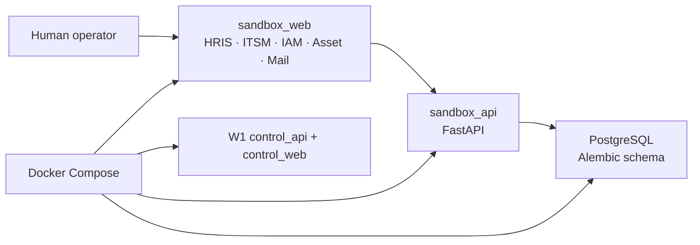

# FlowPilot Arena

> A governed enterprise computer-use agent project and a separate, synthetic
> evaluation environment.
> 面向企业级 Computer-Use Agent 与独立合成评测环境的受治理项目。

**Current status: W2 — Sandbox Foundation.** A human can now complete one
synthetic onboarding flow across HRIS, ITSM, IAM, Asset, and Mail pages. No
agent performs the work, and this is not yet a resettable or gradable Arena.

## What works in W2

| Component | Current capability | Deliberately absent |
|---|---|---|
| `apps/control_api` | W1 static `GET /healthz` | Database, tasks, agent, external calls |
| `apps/control_web` | W1 static foundation page | API calls or business workflow |
| `apps/sandbox_api` | Five linked create/list modules with PostgreSQL, SQLAlchemy, and Alembic | Auth, tenancy, workflow, update/delete, real integrations |
| `apps/sandbox_web` | Five explicit manual module routes | Playwright, agent loop, reset, seed, grader |
| `deploy/compose` | Both W1 apps plus PostgreSQL and both Sandbox apps | Queue, object storage, Keycloak, Temporal, monitoring |



## Quick start

Prerequisites: Docker Compose. Local-only database credentials are committed in
Compose for this isolated development environment and must never be reused in
another environment.

```powershell
docker compose -f deploy/compose/compose.yaml up --build -d
docker compose -f deploy/compose/compose.yaml ps
```

The Sandbox API applies `alembic upgrade head` during startup before it becomes
healthy. Open:

- Sandbox web: `http://127.0.0.1:5174/hris`
- Sandbox API docs: `http://127.0.0.1:8001/docs`
- W1 control web: `http://127.0.0.1:5173`
- W1 control API health: `http://127.0.0.1:8000/healthz`

Stop and discard the local development volume with:

```powershell
docker compose -f deploy/compose/compose.yaml down -v
```

This operator command is not an application Reset API and does not implement
W3 task or seed semantics.

## Manual synthetic onboarding

Use the five navigation tabs in order:

1. **HRIS:** create Avery Example with
   `avery.example@flowpilot.invalid`, Platform Engineering, Sandbox Engineer,
   Shanghai Lab, and start date `2026-08-03`. Note the returned employee ID.
2. **ITSM:** create `Synthetic onboarding for Avery Example` for that ID.
3. **IAM:** create username `avery.example`; W2 fixes role/status to
   `employee` / `active`.
4. **Asset:** assign `SYN-LAPTOP-0001`, model `ExampleBook 14`.
5. **Mail:** create `avery.example@flowpilot.invalid` for the employee.
6. Revisit all five tabs and verify the linked employee ID and final statuses.

The API rejects deliverable email domains and non-`SYN-` asset tags. These
values are conspicuously fictional; the recipe is not a W3 resettable dataset.

## Local development and quality

Python targets 3.13 and uses `uv`; both frontends use npm locks. On Windows
where PowerShell blocks `npm.ps1`, use `npm.cmd`.

```powershell
Push-Location apps/sandbox_api
uv sync --locked --all-groups
uv run ruff check .
uv run ruff format --check .
uv run mypy src
uv run pytest
Pop-Location

Push-Location apps/sandbox_web
npm.cmd ci
npm.cmd run lint
npm.cmd run typecheck
npm.cmd run test
npm.cmd run build
Pop-Location
```

The full W1 regression, Compose runtime, secret-scan, and diff-review sequence
is frozen in [docs/plans/week-02-sandbox.md](docs/plans/week-02-sandbox.md).

## Safety and milestone boundary

W2 uses no paid model and connects to no real enterprise system or external
API. It contains no Arena Task Spec, generic Reset/Seed, grader, baseline tool,
Playwright, browser worker, Agent loop, VLM/OCR, Temporal, planner, verifier,
approval flow, identity, RBAC, or tenant isolation. See
[docs/agent-contract.md](docs/agent-contract.md) and
[docs/threat-model.md](docs/threat-model.md).

Development occurs only on `week/02-sandbox`. No push, PR, merge, or tag is
authorized by these instructions. Licensed under the
[Apache License 2.0](LICENSE).
