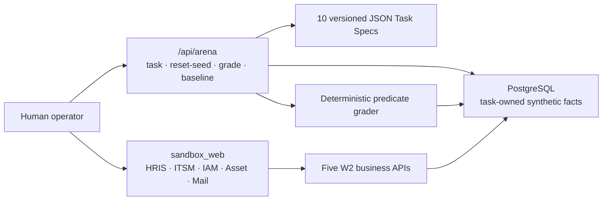

# FlowPilot Arena

> A governed enterprise computer-use agent project and a separate, synthetic
> evaluation environment.
> 面向企业级 Computer-Use Agent 与独立合成评测环境的受治理项目。

**Current status: W3 — Arena Foundation.** Ten fixed synthetic onboarding
tasks can be strictly validated, transactionally Reset/Seed, completed by a
human through the five W2 pages, and deterministically graded from database
facts. W3 does not run an Agent or automate a browser.

## What works in W3

| Component | Current capability | Deliberately absent |
|---|---|---|
| `apps/control_api` | W1 static `GET /healthz` | Database, tasks, Agent, external calls |
| `apps/control_web` | W1 static foundation page | API calls or business workflow |
| Sandbox business API | W2 manual create/list for HRIS, ITSM, IAM, Asset, and Mail | Auth, tenancy, production workflow, real integrations |
| Arena API | Strict task catalog/detail, task-only Reset/Seed, read-only grade, anonymous baseline records | Browser control, arbitrary reset/query, benchmark execution |
| `apps/sandbox_web` | Five explicit manual business routes | Playwright, Agent loop, screenshots, telemetry |
| PostgreSQL/Alembic | Five task-markable fact tables plus baseline records | Control-plane state or real enterprise data |



## Quick start

Prerequisite: Docker Compose. The committed database value is local-only for
this disposable synthetic environment and must never be reused elsewhere.

```powershell
docker compose -f deploy/compose/compose.yaml up --build -d
docker compose -f deploy/compose/compose.yaml ps
```

The Sandbox API applies `alembic upgrade head` before becoming healthy. Open:

- Sandbox web: `http://127.0.0.1:5174/hris`
- Sandbox API docs: `http://127.0.0.1:8001/docs`
- W1 control web: `http://127.0.0.1:5173`
- W1 control API health: `http://127.0.0.1:8000/healthz`

Stop and discard the entire local development volume only when explicitly
desired:

```powershell
docker compose -f deploy/compose/compose.yaml down -v
```

That operator command is distinct from W3 task Reset/Seed. The W3 API never
truncates the database or touches rows outside one selected task marker.

## Run one manual Arena task

The following uses task `w3-joiner-001`; task detail contains the human
instructions, initial facts, expected identifiers, predicates, fixture version,
and canonical checksum.

```powershell
$task = Invoke-RestMethod http://127.0.0.1:8001/api/arena/tasks/w3-joiner-001
$seed = Invoke-RestMethod -Method Post `
  http://127.0.0.1:8001/api/arena/tasks/w3-joiner-001/reset-seed
```

Use the target employee ID from `$seed.seed_summary` and complete exactly one
ticket, ordinary IAM account, laptop, and mailbox through `/hris`, `/itsm`,
`/iam`, `/assets`, and `/mail`. The decoy employee exists only to make incorrect
links observable. Then grade from database facts:

```powershell
$grade = Invoke-RestMethod -Method Post `
  http://127.0.0.1:8001/api/arena/tasks/w3-joiner-001/grade
$grade | ConvertTo-Json -Depth 5
```

A baseline record accepts only a synthetic record ID, catalog task ID,
anonymous alias, offset-aware start/end timestamps, manual action count, and
optional synthetic notes. Its final score is derived by the Grader at record
time; the operator cannot self-report success. See the OpenAPI page for the
request shape.

## Determinism and frozen splits

- Task Specs reject unknown fields, invalid references, duplicate IDs,
  deliverable email domains, non-synthetic assets, unsupported predicates, and
  checksum mismatch.
- Fixed IDs, dates, values, and timestamps make repeated Reset/Seed facts
  stable. No random, current-time, network, model, or external-service input
  creates task facts.
- Tasks 001–006 are Development, 007–008 Validation, and 009–010 Reporting.
  Reporting spec content/checksums freeze on the first W3 commit and must not
  be tuned against results before W15.
- This ten-task joiner set is not the roadmap's final 30-template dataset and
  is not an Agent benchmark result.

## Local development and quality

Python targets 3.13 and uses `uv`; both frontends use committed npm locks. On
Windows systems where PowerShell blocks `npm.ps1`, use `npm.cmd`.

```powershell
Push-Location apps/sandbox_api
uv sync --locked --all-groups
uv run ruff check .
uv run ruff format --check .
uv run mypy src
uv run pytest
Pop-Location

Push-Location apps/sandbox_web
npm.cmd ci
npm.cmd run lint
npm.cmd run typecheck
npm.cmd run test
npm.cmd run build
Pop-Location
```

The complete W1/W2/W3 regression, migration, Compose, secret-scan, and diff
sequence is frozen in [docs/plans/week-03-arena.md](docs/plans/week-03-arena.md).

## Safety and milestone boundary

W3 uses no paid model and connects to no real enterprise system or external
API. It contains no Playwright/Selenium, browser worker, DOM/accessibility
observation, typed browser action, Agent loop, screenshot/OCR/VLM, faults,
router, planner, verifier, Temporal/recovery, memory, approval, OIDC/RBAC,
tenancy, arbitrary SQL/Shell/file interface, or benchmark execution. See
[docs/agent-contract.md](docs/agent-contract.md) and
[docs/threat-model.md](docs/threat-model.md).

Development occurs only on `week/03-arena`. No push, PR, merge, or W3 tag is
authorized by these instructions. Licensed under the
[Apache License 2.0](LICENSE).
