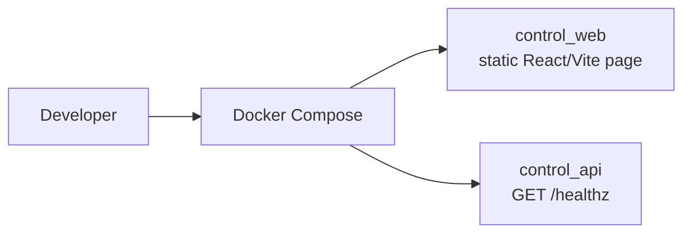

# FlowPilot Arena

> A governed foundation for a future enterprise computer-use agent and its
> resettable evaluation arena.
> 面向企业级 Computer-Use Agent 与可重置评测环境的受治理基础仓库。

**Current status: W1 — Foundation.** This branch deliberately contains only a
minimal runnable control-plane smoke path and the delivery rules needed to
build later milestones safely. It does not yet automate enterprise work.

## What this project will address

FlowPilot is planned as two connected, but distinct, systems:

- **Control Plane** — the future multi-user system for safe task coordination.
- **Arena** — the future resettable enterprise-app simulation used to evaluate
  the system deterministically.

The roadmap's target business domain is Joiner / Mover / Leaver operations.
W1 does not implement those operations, any enterprise application, or an
agent.

## What works in W1

| Component | Current capability | Intentionally absent |
|---|---|---|
| `apps/control_api` | FastAPI `GET /healthz` smoke endpoint | Auth, database, tasks, models, integrations |
| `apps/control_web` | Static React/Vite foundation page | Routing, login, data/API calls, enterprise UI |
| `deploy/compose` | Two-service API + web local Compose skeleton | Workers, database, queues, storage, monitoring |



The long-term architecture is documented in
[docs/architecture.md](docs/architecture.md); it is not a claim that those
future components already exist.

## Quick start

Prerequisites: Python 3.13, [uv](https://docs.astral.sh/uv/), Node.js 22.12+
and npm, plus Docker Compose for the optional container path.

```powershell
# API
Push-Location apps/control_api
uv sync --locked --all-groups
uv run uvicorn flowpilot_control_api.main:app --host 127.0.0.1 --port 8000

# In a second terminal
Invoke-RestMethod http://127.0.0.1:8000/healthz
```

```powershell
# Web
Push-Location apps/control_web
npm ci
npm run dev
```

On Windows environments where PowerShell blocks `npm.ps1`, run `npm.cmd` in
place of `npm`.

To render the local container configuration:

```powershell
docker compose -f deploy/compose/compose.yaml config
```

The legacy-compatible `docker-compose` executable is also supported.

## Quality checks

```powershell
Push-Location apps/control_api
uv run ruff check .
uv run ruff format --check .
uv run mypy src
uv run pytest
Pop-Location

Push-Location apps/control_web
npm run lint
npm run typecheck
npm run test
npm run build
Pop-Location
```

The GitHub Actions workflow runs backend checks, frontend checks/build, Compose
validation, and a Gitleaks secret scan. See
[docs/plans/week-01-foundation.md](docs/plans/week-01-foundation.md) for the
complete acceptance sequence.

## Safety and scope boundary

W1 makes no paid-model calls and connects to no real enterprise system. It
does not include a Sandbox, Agent loop, Playwright, VLM/OCR, Temporal
workflow, identity system, database, task evaluation, or benchmark. Those
remain separately gated roadmap milestones.

Read [SECURITY.md](SECURITY.md) before reporting a vulnerability, and
[CONTRIBUTING.md](CONTRIBUTING.md) before proposing a change. The authoritative
W1 file and scope contract is [docs/agent-contract.md](docs/agent-contract.md).

## Delivery discipline

Development occurs on independent weekly branches such as
`week/01-foundation`; `main` is never developed on directly. Each weekly PR
must carry its plan, evidence report, validation results, known limitations,
and model-cost disclosure. A weekly tag is created only after an authorized,
green PR merge to `main`.

## License

Licensed under the [Apache License 2.0](LICENSE).
