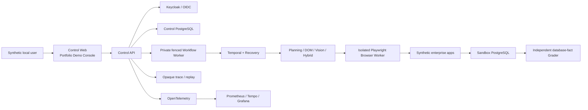

# FlowPilot Arena

<div align="center">

### A governed enterprise Computer-Use Agent paired with a resettable synthetic Arena

[English](README.md) · [简体中文](README.zh-CN.md)

[](https://github.com/taka-wzx/flowpilot-arena/actions/workflows/ci.yml)
[](https://github.com/taka-wzx/flowpilot-arena/releases/tag/v1.0.0)
[](LICENSE)
[](docs/demo.md)

**Observe → Plan → Execute → Recover → Verify**

FlowPilot coordinates bounded Joiner, Mover, and Leaver workflows across
synthetic enterprise applications. The Agent can inspect changing pages, plan
typed actions, recover from interruption, and pause for human approval. It
never becomes the authority: identity, tenant/RBAC, approval, audit,
queue/lease/fence, and receipt/idempotency remain in the Control Plane, while
an independent Sandbox database-fact Grader determines task success.

[Run the demo](#five-minute-local-demo) ·
[Explore the architecture](#architecture) ·
[Review the evidence](#verified-portfolio-results) ·
[Review the release evidence](docs/evidence/week-16-release.md)

</div>

> [!IMPORTANT]
> The released demo is local, deterministic, and synthetic. It uses a fake
> provider, synthetic identities, and synthetic data. Real provider, model,
> OCR, VLM, embedding, billing, and account-data calls and real cost are zero.
> It is a portfolio-quality engineering demonstration, not a production
> deployment or model-quality certification.

## What this project demonstrates

| Capability | Engineering focus |
|---|---|
| Governed agent execution | OIDC identity, tenant isolation, RBAC, L0-L4 approval, strong ETags, and tamper-evident audit chains |
| Durable orchestration | Temporal workflows, checkpoints, bounded recovery, queue/rate controls, leases, fences, and idempotent receipts |
| Browser safety | Isolated Playwright contexts, a closed typed action space, prompt-injection defenses, and no arbitrary code execution |
| Independent evaluation | A resettable synthetic Arena and database-fact Grader that remain separate from Agent terminal state |
| Observable delivery | Trace/replay, OpenTelemetry, Prometheus, Tempo, Grafana, deterministic test artifacts, and redacted evidence |
| Reproducible release | Docker Compose, digest-only Helm packaging, GitHub Actions, SLSA provenance, SPDX SBOM, and Trivy/gitleaks gates |

## Verified portfolio results

Every number below retains the scope of its original frozen protocol. Synthetic
results are not claims about real model quality, production SLOs, ROI, or
statistical significance.

| Evidence scope | Verified result | Source |
|---|---:|---|
| W15 evaluation matrix | 11 configurations × 3 seeds × 18 instances; 594/594 planned primary attempts executed, with 0 timeouts or missing records | [W15 report](docs/evidence/week-15-report.md) |
| W15 full system | 83.33% synthetic task success; +31.48 percentage points over the paired DOM ReAct baseline | [W15 report](docs/evidence/week-15-report.md) |
| W15 recovery and safety | 100% recovery; 0 security failures; 0 duplicate business effects | [W15 report](docs/evidence/week-15-report.md) |
| W15 evaluation runtime | 133.988 ms full-system API p95; maximum browser concurrency 4 | [W15 report](docs/evidence/week-15-report.md) |
| W12 load validation | 50 users and 1,000 protected requests; 353.186 ms API p95; 0 unexpected HTTP responses or 5xx | [W12 report](docs/evidence/week-12-report.md) |
| W17 Demo Console | 27 tests plus lint, typecheck, and production build gates | [W17 evidence](docs/evidence/week-17-portfolio-demo-console.md) |
| Release images | Four exact-digest images; 0 HIGH/CRITICAL and 0 secret findings; native SLSA provenance and SPDX 2.3 SBOM attestations | [W16 release evidence](docs/evidence/week-16-release.md) |

The W15 `finished_ungraded` state means only that Agent execution terminated.
It is never interpreted as business success; only the independent Grader can
make that determination.

## Portfolio Demo Console

W17 turns the Control Web into a resume-ready presentation of the existing
system without expanding backend authority.

- A visible `SYNTHETIC LOCAL DEMO` environment marker.
- Identity, organization, role, active/terminal runs, pending approvals, and
  audit-chain state.
- Fixed Joiner/Mover/Leaver submissions using closed schemas and synthetic task
  references.
- Filterable run history, bounded detail, and an
  observe → plan → execute → recover → verify timeline.
- Constrained trace/replay with explicit missing-evidence states.
- Existing strong-ETag approval decisions and stale-decision protection.
- Five-second polling bounded to two minutes, plus manual refresh and cleanup on
  terminal state, page hiding, error, or unmount.
- Strict separation between Agent state and the independent Grader result.
- Keyboard-operable, responsive UI with loading, empty, forbidden, failure,
  stale, and polling-timeout states.

See the [step-by-step demo guide](docs/demo.md),
[W17 ADR](docs/adr/0017-w17-portfolio-demo-console.md), and
[implementation plan](docs/plans/week-17-portfolio-demo-console.md).

## Architecture



### Authority and recovery boundaries

1. Browser, page, OCR, and model content are untrusted data, never authority.
2. The Agent selects only typed actions inside a closed server-defined policy.
3. High-risk actions stop for organization-qualified human approval.
4. Temporal checkpoints, leases/fences, and receipts make redelivery safe and
   prevent stale Workers from committing effects.
5. The Agent finishes as `finished_ungraded`; the independent Sandbox Grader
   checks database facts and decides the synthetic task outcome.

More detail is available in the [architecture](docs/architecture.md) and
[threat model](docs/threat-model.md).

## Technology stack

| Layer | Technologies |
|---|---|
| Control and Sandbox APIs | Python 3.13, FastAPI, Pydantic, SQLAlchemy, Alembic, PostgreSQL |
| Agent runtime | Temporal, Playwright, typed DAG planning, DOM/Vision/Hybrid routing, bounded recovery |
| Identity and governance | OIDC, Keycloak, tenant RBAC, approval policy, ETag concurrency, audit chains |
| Web | React 19, TypeScript, Vite, Vitest, Testing Library |
| Observability | OpenTelemetry, Prometheus, Tempo, Grafana, bounded trace/replay |
| Delivery | Docker Compose, Helm/Kubernetes, GitHub Actions, SLSA provenance, SPDX SBOM, Trivy |
| Quality | pytest, mypy, Ruff, ESLint, Vitest, Locust, gitleaks, detect-private-key |

## Five-minute local demo

Requirements: Python 3.13, uv, Node.js 24/npm, and Docker Compose. No cloud
account, registry credential, external benchmark, or real provider is required.

```powershell
$env:RECOVERY_ENVELOPE_KEY = '<runtime-only local key>'
docker compose -f deploy/compose/compose.yaml config
docker compose -f deploy/compose/compose.yaml up --build -d
docker compose -f deploy/compose/compose.yaml ps
docker compose -f deploy/compose/compose.yaml --profile acceptance run --build --rm acceptance-smoke
python tests/integration/w16_demo_smoke.py
docker compose -f deploy/compose/compose.yaml down -v --remove-orphans
Remove-Item Env:RECOVERY_ENVELOPE_KEY
```

After the stack is healthy:

- Control Web: <http://127.0.0.1:5173>
- Sandbox Web: <http://127.0.0.1:5174>

The Control Web uses a normal separate-tab link to the Sandbox; it does not
embed the Sandbox or bypass browser isolation. The volume cleanup above resets
only the local synthetic stack.

## Repository map

```text
apps/
├── control_api/       Identity, tenant/RBAC, approval, audit, run admission
├── control_web/       W17 Portfolio Demo Console
├── workflow_worker/   Private outbox, lease, fence, and dispatch boundary
├── recovery_worker/   Temporal durable recovery and checkpoints
├── planning_agent/    Typed bounded DAG planning
├── dom_agent/         DOM-only execution path
├── vision_agent/      Vision-only execution path
├── hybrid_agent/      Deterministic DOM/Vision routing
├── browser_worker/    Isolated Playwright execution
├── sandbox_api/       Synthetic enterprise state and independent Grader
└── sandbox_web/       Synthetic enterprise UI
deploy/
├── compose/           Authoritative local topology
└── helm/              Closed, digest-only Kubernetes packaging
tests/
├── integration/       End-to-end acceptance and evidence smokes
└── load/              Frozen W12 Locust validation profile
docs/                  Architecture, threat model, ADRs, plans, and evidence
```

## Evidence and documentation

- [Demo walkthrough](docs/demo.md)
- [Architecture](docs/architecture.md)
- [Threat model](docs/threat-model.md)
- [W15 evaluation report](docs/evidence/week-15-report.md)
- [Benchmark card](docs/benchmark-card.md)
- [Model card](docs/model-card.md)
- [W16 release evidence](docs/evidence/week-16-release.md)
- [W17 Demo Console evidence](docs/evidence/week-17-portfolio-demo-console.md)
- [SPDX SBOM](docs/sbom.spdx.json) and [SBOM status](docs/sbom-status.md)

## Release and security posture

- Current `main` adds the W17 Portfolio Demo Console after `v1.0.0`; the
  immutable `v1.0.0` tag remains the W16 release and does not contain the W17
  presentation-layer changes.
- The public `v1.0.0` GitHub Release and annotated tag are immutable.
- Enabled Helm components require an exact `repository@sha256:<64 hex>` image;
  no `latest` image is created.
- Containers run non-root with read-only root filesystems, dropped capabilities,
  RuntimeDefault seccomp, fixed resources, probes, and default-deny networking.
- The latest verified four-image release run found zero HIGH/CRITICAL
  vulnerabilities and zero secrets, with native provenance/SBOM attestations.
- A temporary Aliyun ECS single-node K3s validation exercised only the two Web
  images over loopback and was removed afterward. It was not ACK, public
  ingress, high availability, or production certification.

Read [SECURITY.md](SECURITY.md) before reporting a vulnerability. Release and
attestation details are preserved in the
[W16 evidence record](docs/evidence/week-16-release.md).

## Deliberate limitations

FlowPilot does **not** connect to real HR, IAM, ITSM, mail, or asset systems. It
does not accept arbitrary Shell, SQL, JavaScript, provider, URL, secret, or
personal-data inputs. It provides no impersonation, global administrator,
break-glass, physical delete, public deployment, production identity, managed
ACK deployment, external WorkArena benchmark, production SLO, ROI, or security
certification. WorkArena remains `unavailable/local_assets_absent` because no
versioned local assets, license materials, or checksums are present.

## Contributing and license

Contributions are welcome within the documented authority and security
boundaries. See [CONTRIBUTING.md](CONTRIBUTING.md) and the
[W17 agent contract](docs/agent-contract.md) before making changes.

Licensed under [Apache-2.0](LICENSE).
