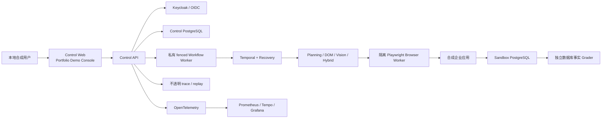

# FlowPilot Arena

<div align="center">

### 受治理的企业级 Computer-Use Agent 与可重置合成 Arena

[English](README.md) · [简体中文](README.zh-CN.md)

[](https://github.com/taka-wzx/flowpilot-arena/actions/workflows/ci.yml)
[](https://github.com/taka-wzx/flowpilot-arena/releases/tag/v1.0.0)
[](LICENSE)
[](docs/demo.md)

**观察 → 规划 → 执行 → 恢复 → 验证**

FlowPilot 面向合成企业应用协调入职、转岗和离职流程。Agent 能够观察变化页面、
规划类型化动作、从中断中恢复，并在高风险操作前等待人工审批；但 Agent 永远不
是权威来源。身份、租户/RBAC、审批、审计、队列/租约/栅栏和幂等回执由 Control
Plane 强制执行，只有独立 Sandbox 数据库事实 Grader 能判定任务是否成功。

[运行 Demo](#五分钟本地-demo) ·
[查看架构](#系统架构) ·
[核对证据](#可验证的项目结果) ·
[查看发布证据](docs/evidence/week-16-release.md)

</div>

> [!IMPORTANT]
> 已发布 Demo 是本地、确定性和纯合成的，使用 fake provider、合成身份和合成
> 数据。真实 provider、model、OCR、VLM、embedding、billing、账号数据调用和
> 真实成本均为零。这是面向作品集的工程验证，不是生产部署或模型质量认证。

## 项目展示的核心能力

| 能力 | 工程重点 |
|---|---|
| 受治理的 Agent 执行 | OIDC 身份、租户隔离、RBAC、L0-L4 审批、强 ETag 与防篡改审计链 |
| 持久化编排 | Temporal 工作流、Checkpoint、有界恢复、队列/限流、租约、栅栏与幂等回执 |
| 浏览器安全 | 隔离 Playwright context、封闭的类型化动作空间、Prompt Injection 防护与禁止任意代码执行 |
| 独立评测 | 可重置合成 Arena 与数据库事实 Grader，严格区分 Agent 终态和业务成功 |
| 可观测交付 | trace/replay、OpenTelemetry、Prometheus、Tempo、Grafana、确定性测试产物与脱敏证据 |
| 可复现发布 | Docker Compose、digest-only Helm、GitHub Actions、SLSA provenance、SPDX SBOM 与 Trivy/gitleaks gate |

## 可验证的项目结果

下列每个数字均保留其原始冻结协议的适用范围。合成结果不代表真实模型质量、生产
SLO、ROI、统计显著性或安全认证。

| 证据范围 | 已验证结果 | 来源 |
|---|---:|---|
| W15 评测矩阵 | 11 配置 × 3 种子 × 18 实例；594/594 次计划内主试验均已执行，超时和缺失记录均为 0 | [W15 报告](docs/evidence/week-15-report.md) |
| W15 Full System | 合成任务成功率 83.33%；相对配对 DOM ReAct 基线提升 31.48 个百分点 | [W15 报告](docs/evidence/week-15-report.md) |
| W15 恢复与安全 | 恢复率 100%；安全失败 0；重复业务副作用 0 | [W15 报告](docs/evidence/week-15-report.md) |
| W15 评测运行时 | Full System API P95 为 133.988 ms；浏览器最大并发 4 | [W15 报告](docs/evidence/week-15-report.md) |
| W12 负载验证 | 50 用户、1,000 次受保护请求；API P95 为 353.186 ms；意外 HTTP 响应和 5xx 均为 0 | [W12 报告](docs/evidence/week-12-report.md) |
| W17 Demo Console | 27 项测试通过，lint、typecheck 与 production build gate 通过 | [W17 证据](docs/evidence/week-17-portfolio-demo-console.md) |
| 发布镜像 | 4 个精确 digest 镜像；HIGH/CRITICAL 与 secret 发现均为 0；具备 native SLSA provenance 和 SPDX 2.3 SBOM Attestation | [W16 发布证据](docs/evidence/week-16-release.md) |

W15 的 `finished_ungraded` 仅表示 Agent 执行终止，绝不等于业务成功；只有独立
Grader 能做出该判定。

## Portfolio Demo Console

W17 将 Control Web 收敛为可直接用于作品集展示的控制台，但不扩展任何后端权限。

- 显示明确的 `SYNTHETIC LOCAL DEMO` 环境标记。
- 展示身份、组织、角色、活动/终态 run 数、待审批数和 audit-chain 状态。
- 使用封闭 schema 与合成任务引用提交固定 Joiner/Mover/Leaver 流程。
- 支持 run 历史筛选、受限详情，以及观察 → 规划 → 执行 → 恢复 → 验证时间线。
- 提供受限 trace/replay，并明确展示缺失证据，不编造阶段状态。
- 复用强 ETag 审批决策和 stale-decision 防护。
- 使用 5 秒固定轮询与 2 分钟上限，支持手动刷新，并在终态、页面隐藏、错误或
  unmount 时清理。
- 严格区分 Agent 状态与独立 Grader 结果。
- 响应式、键盘可操作，并覆盖 loading、empty、forbidden、failure、stale 和
  polling-timeout 状态。

详见 [Demo 分步指南](docs/demo.md)、
[W17 ADR](docs/adr/0017-w17-portfolio-demo-console.md) 和
[实施计划](docs/plans/week-17-portfolio-demo-console.md)。

## 系统架构



### 权威与恢复边界

1. 浏览器、页面、OCR 和模型内容只是不可信数据，永远不是权限来源。
2. Agent 只能在服务端定义的封闭策略内选择类型化动作。
3. 高风险动作必须停止并等待组织范围内的人工审批。
4. Temporal Checkpoint、租约/栅栏和回执保证重投安全，并阻止过期 Worker 提交
   业务副作用。
5. Agent 以 `finished_ungraded` 结束；独立 Sandbox Grader 检查数据库事实并判定
   合成任务结果。

更多说明见[系统架构](docs/architecture.md)和[威胁模型](docs/threat-model.md)。

## 技术栈

| 层级 | 技术 |
|---|---|
| Control 与 Sandbox API | Python 3.13、FastAPI、Pydantic、SQLAlchemy、Alembic、PostgreSQL |
| Agent Runtime | Temporal、Playwright、类型化 DAG Planning、DOM/Vision/Hybrid 路由、有界恢复 |
| 身份与治理 | OIDC、Keycloak、租户 RBAC、审批策略、ETag 并发控制、审计链 |
| Web | React 19、TypeScript、Vite、Vitest、Testing Library |
| 可观测性 | OpenTelemetry、Prometheus、Tempo、Grafana、受限 trace/replay |
| 交付 | Docker Compose、Helm/Kubernetes、GitHub Actions、SLSA provenance、SPDX SBOM、Trivy |
| 质量保障 | pytest、mypy、Ruff、ESLint、Vitest、Locust、gitleaks、detect-private-key |

## 五分钟本地 Demo

依赖：Python 3.13、uv、Node.js 24/npm 和 Docker Compose。不需要云账号、镜像
仓库凭据、外部 Benchmark 或真实 provider。

```powershell
$env:RECOVERY_ENVELOPE_KEY = '<runtime-only local key>'
docker compose -f deploy/compose/compose.yaml config
docker compose -f deploy/compose/compose.yaml up --build -d
docker compose -f deploy/compose/compose.yaml ps
docker compose -f deploy/compose/compose.yaml --profile acceptance run --build --rm acceptance-smoke
python tests/integration/w16_demo_smoke.py
docker compose -f deploy/compose/compose.yaml down -v --remove-orphans
Remove-Item Env:RECOVERY_ENVELOPE_KEY
```

本地服务健康后打开：

- Control Web：<http://127.0.0.1:5173>
- Sandbox Web：<http://127.0.0.1:5174>

Control Web 只使用普通的新标签页链接进入 Sandbox，不嵌入 Sandbox，也不绕过
浏览器隔离。上述 volume 清理仅重置本地合成环境。

## 仓库导航

```text
apps/
├── control_api/       身份、租户/RBAC、审批、审计与 run admission
├── control_web/       W17 Portfolio Demo Console
├── workflow_worker/   私有 outbox、lease、fence 与 dispatch 边界
├── recovery_worker/   Temporal 持久恢复与 Checkpoint
├── planning_agent/    类型化有界 DAG Planning
├── dom_agent/         DOM-only 执行路径
├── vision_agent/      Vision-only 执行路径
├── hybrid_agent/      确定性 DOM/Vision 路由
├── browser_worker/    隔离 Playwright 执行
├── sandbox_api/       合成企业状态与独立 Grader
└── sandbox_web/       合成企业 UI
deploy/
├── compose/           权威本地拓扑
└── helm/              封闭的 digest-only Kubernetes 包装
tests/
├── integration/       端到端 acceptance 与 evidence smoke
└── load/              冻结的 W12 Locust 验证 profile
docs/                  架构、威胁模型、ADR、计划与证据
```

## 证据与文档

- [Demo walkthrough](docs/demo.md)
- [系统架构](docs/architecture.md)
- [威胁模型](docs/threat-model.md)
- [W15 评测报告](docs/evidence/week-15-report.md)
- [Benchmark Card](docs/benchmark-card.md)
- [Model Card](docs/model-card.md)
- [W16 发布证据](docs/evidence/week-16-release.md)
- [W17 Demo Console 证据](docs/evidence/week-17-portfolio-demo-console.md)
- [SPDX SBOM](docs/sbom.spdx.json) 与 [SBOM 状态](docs/sbom-status.md)

## 发布与安全状态

- 当前 `main` 在 `v1.0.0` 之后增加了 W17 Portfolio Demo Console；不可变的
  `v1.0.0` tag 仍是 W16 发布，不包含 W17 展示层改动。
- 公开的 `v1.0.0` GitHub Release 与 annotated tag 保持不可变。
- 启用 Helm 组件必须提供精确的 `repository@sha256:<64 hex>` 镜像；不会创建
  `latest` 镜像。
- 容器以非 root、只读根文件系统、drop capabilities、RuntimeDefault seccomp、
  固定资源、探针与 default-deny 网络策略运行。
- 最新验证的四镜像发布 run 为零 HIGH/CRITICAL、零 secret，并具备 native
  provenance/SBOM Attestation。
- 临时阿里云 ECS 单节点 K3s 验证只检查了两个 Web 镜像和 loopback，随后已清理；
  它不是 ACK、公网入口、高可用或生产认证。

报告漏洞前请阅读 [SECURITY.md](SECURITY.md)。发布与 Attestation 细节保存在
[W16 证据记录](docs/evidence/week-16-release.md)中。

## 明确限制

FlowPilot **不会**连接真实 HR、IAM、ITSM、mail 或 asset 系统，不接受任意 Shell、
SQL、JavaScript、provider、URL、secret 或个人数据输入。项目不提供
impersonation、全局管理员、break-glass、物理删除、公网部署、生产身份、托管 ACK、
外部 WorkArena Benchmark、生产 SLO、ROI 或安全认证。WorkArena 保持
`unavailable/local_assets_absent`，因为仓库中没有版本化本地资产、许可材料或
checksum。

## 贡献与许可证

欢迎在既有权威和安全边界内贡献。修改前请阅读
[CONTRIBUTING.md](CONTRIBUTING.md) 与
[W17 agent contract](docs/agent-contract.md)。

项目使用 [Apache-2.0](LICENSE) 许可证。
