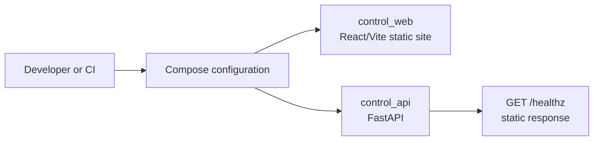

# Architecture

## W1 current-state architecture

W1 uses a minimal monorepo with two runnable application roots. They are
separate build contexts and dependency locks so that the Python and frontend
toolchains remain reproducible without introducing shared runtime services.

| Boundary | W1 responsibility | W1 does not contain |
|---|---|---|
| `apps/control_api` | Serve an in-process health response | Database, identity, tasks, model or external calls |
| `apps/control_web` | Render a static foundation page | API fetching, routing, login, business pages |
| `deploy/compose` | Build and wire the two local services | Data stores, queues, workers, observability |
| `.github` | Reproduce quality and secret checks | Hosted settings or deployment credentials |

The two services share no runtime state. `control_web` depends on a passing API
healthcheck in Compose solely to prove the basic startup ordering; it does not
call the API.

## Long-term topology is deferred

The roadmap names future Control Plane, Sandbox, Arena, browser, workflow,
policy, identity, storage, and observability components. W1 intentionally does
not create placeholder directories for them. Their eventual boundaries must be
introduced only by the weekly contract that owns them, with an ADR when the
decision changes the architecture.

## Deployment assumptions

- Local container execution uses two containers only: Python API and static
  web server.
- No application configuration requires a secret in W1.
- Docker Compose validation renders configuration; it is not evidence of a
  production deployment.
- CI uses the same dependency lock and build commands as local development.

## Decision record

See [adr/0001-w1-minimal-monorepo.md](adr/0001-w1-minimal-monorepo.md) for the
reasoning behind this small initial structure.
