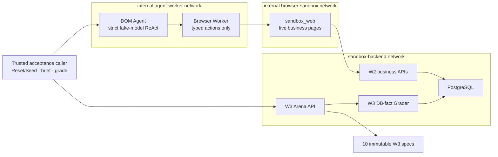

# Architecture

## W4 current-state architecture

W4 preserves the W1 stateless control paths, W2 five-module Sandbox, and W3
deterministic Arena. Browser execution and Agent reasoning are new independent
services. Neither service is part of `sandbox_api`, has a database credential,
or can declare task success.

The one-off `acceptance-smoke` profile is the trusted caller for deterministic
Compose acceptance. It connects to W1 health, W3 management, and DOM Agent
networks, but contains no model, Browser, database driver, or general execution
API. Normal `up` does not start it.

| Boundary | W4 responsibility | W4 deliberately excludes |
|---|---|---|
| `apps/control_api`, `apps/control_web` | Preserve W1 health/static behaviour | Agent, browser, database |
| Sandbox API/web/PostgreSQL | Preserve W2 pages and W3 Arena facts | Browser/Agent embedding |
| Browser Worker | Per-task Browser/Context/Page, URL guard, bounded observation, typed action, cleanup | DB/API credentials, selector/code input, external origin, uploads/downloads, screenshots |
| DOM Agent | Strict model-decision parsing, Worker client, action/history/budget loop | Sandbox/Arena/Grader client, planner, verifier, memory, real provider by default |
| Acceptance caller | Two Reset/Seed calls, human brief, Agent invocation, independent grade | Model tool access or success override |

## Browser Worker process and network boundary

`apps/browser_worker` is a non-root FastAPI container with a read-only root
filesystem, all Linux capabilities dropped, `no-new-privileges`, bounded
process/shared-memory/tmpfs limits, no bind mount, and no Docker socket. It is
attached only to:

- `browser-sandbox`, shared with `sandbox-web`;
- `agent-worker`, shared with `dom-agent`.

Both networks are Docker-internal and have no gateway. Browser Worker cannot
resolve `sandbox-api` or PostgreSQL. Same-origin page JavaScript reaches the W2
business API through the existing `sandbox-web` reverse proxy; Worker code does
not call business endpoints.

The configured origin is exactly `http://sandbox-web`. Navigation policy allows
only `/hris`, `/itsm`, `/iam`, `/assets`, and `/mail`. Request interception
allows same-origin assets/API fetches and aborts other origins, including
redirect escape. URL user information and query/fragment components are also
rejected, as are the `file`, `data`, and `javascript` schemes, external HTTP(S),
and direct API paths.

Each session starts a separate Playwright process, Browser Context, and Page.
Finish, failure, timeout, budget exhaustion, explicit delete, startup error,
and service shutdown all close Page, Context, Browser, and Playwright handles.

## DOM/accessibility observation

Schema `w4-dom-observation/1.0` includes:

- internal session and observation identifiers;
- local current URL and normalized title;
- stable DOM-order semantic nodes with bounded role/name/text;
- stable DOM-order interactive elements with role, accessible name, safe
  state, exposed select labels, allowed actions, and opaque `element_ref`;
- sanitized last-action result/page error and a truncation flag.

The internal extractor uses fixed source code and fixed selectors that are
never API/model inputs or outputs. It excludes hidden nodes, script/style-like
content by construction, attributes, input values, password contents, Cookies,
Local Storage, and long text. Limits are 120 semantic nodes, 80 interactives,
240 characters per node, and 32 KiB serialized observation by default.

Every observation has a fresh worker-generated nonce. References are held only
in the session's current in-memory map and are replaced after every action or
failed action. Observation mismatch, unknown reference, or action/ref mismatch
fails before Playwright execution. No selector or locator recipe leaves the
Worker.

There is no screenshot, pixel, image path, OCR, VLM, visual feature, trace,
network log, or image storage field.

## Typed browser actions

Schema `w4-dom-action/1.0` is a strict discriminated union:

- `navigate` with one allowed URL/path;
- `click`, `fill`, `select`, `read`, and `scroll` with current observation and
  element reference;
- bounded `wait`;
- terminal `finish` and `fail`/escalate.

Unknown fields/actions and wrong JSON types are rejected. `fill` rejects
password controls, real email domains, credential-like words, payment-number-
like values, control characters, multiline input, and text above 300
characters. Select accepts only labels exposed in the current observation.
Structured results use `w4-dom-action-result/1.0` and return a new observation
for every non-terminal result.

## Minimal DOM Agent loop

`apps/dom_agent` is a separate non-root/read-only container attached only to
`agent-worker`. It can resolve Browser Worker but not Sandbox Web/API or
PostgreSQL. Its only outbound client has fixed create/action/delete Worker
routes and strict response parsing.

The model context is limited to a human-facing task brief, the current
observation, six bounded action summaries, and remaining budgets. Model output
must validate as `w4-model-decision/1.0` containing one typed action. Hard caps
cover steps, model calls, repeated identical actions, no-progress states,
wall time, input/output tokens, and provider-reported micro-USD cost.

W4 supplies deterministic fake scenarios only. `AgentRunResult` has no
`success`, `passed`, `score`, or Grader field. `finish` produces
`finished_ungraded`; an independent caller must invoke the unchanged W3 Grader.

## Task input and grading boundary

The acceptance caller may render the W3 title/instructions plus immutable
synthetic expected values into the human-readable “supplied identifiers” brief.
It does not modify a spec/checksum or pass grader predicates. For authorized
real runs it must use tasks 001-005, compare two Reset/Seed results, start at
HRIS, invoke the Agent, then grade. The model never receives Reset/Seed,
database, business API, or Grader tools.

No W4 migration exists. The released W2/W3 heads and all ten W3 specs remain
unchanged. See
[adr/0004-w4-isolated-dom-worker-and-agent.md](adr/0004-w4-isolated-dom-worker-and-agent.md).
