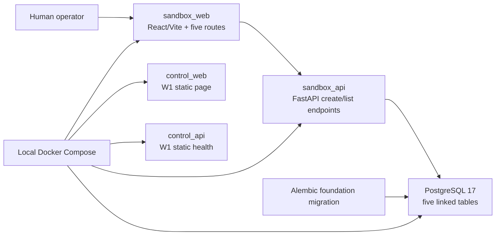
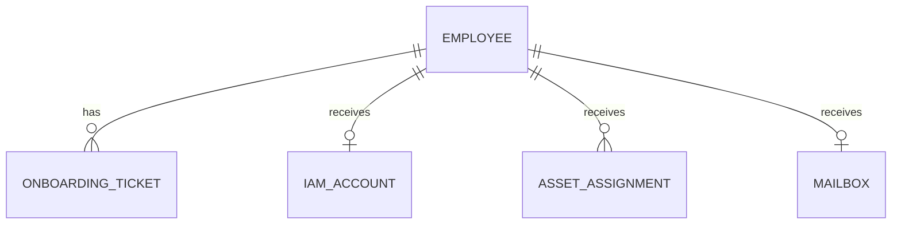

# Architecture

## W2 current-state architecture

W2 preserves the W1 control-plane smoke path and adds a separate synthetic
Sandbox deployment boundary. The Sandbox uses one backend and one frontend;
HRIS, ITSM, IAM, Asset, and Mail are logical modules rather than microservices.

| Boundary | W2 responsibility | W2 does not contain |
|---|---|---|
| `apps/control_api` | Preserve static W1 `/healthz` | Sandbox data, database, agent, external calls |
| `apps/control_web` | Preserve the W1 static page | Sandbox routing or API calls |
| `apps/sandbox_api` | Validate and persist five linked synthetic record types | Auth, tenancy, workflow, reset, grader, update/delete |
| `apps/sandbox_web` | Manual create/list UI on five explicit routes | Browser automation, agent behaviour, real accounts |
| `postgres` | Local Sandbox persistence | Production credentials or control-plane state |
| `deploy/compose` | Start the five W2 containers and one named DB volume | Queue, worker, storage, identity, monitoring |

## Data model

`employees` is the manual linking root. All downstream records use a database
foreign key; IAM username, employee account, asset tag, mailbox employee, and
mailbox address have uniqueness constraints where the W2 closure needs them.
The API accepts only `.invalid` email addresses, the ordinary `employee` role,
one `laptop` device type, and `SYN-` asset tags.

## Runtime and migration

- PostgreSQL is healthy before the Sandbox API starts.
- The Sandbox API runs `alembic upgrade head` through the Alembic Python API in
  its FastAPI lifespan, then begins serving.
- The Sandbox web container proxies only `/api/` to the Sandbox API and serves
  all five SPA paths through an index fallback.
- Unit tests use isolated SQLite only for deterministic ORM/API tests. Compose
  runtime acceptance is the PostgreSQL evidence and cannot be replaced by the
  SQLite tests.
- The committed database credential is explicitly local-only, has no value
  outside this disposable Compose environment, and is not a production secret.

## Deferred topology

The W2 database starts empty. The documented Avery Example flow is a manual
development recipe, not a generic reset/seed mechanism. Arena tasks, reset,
seed, graders, splits, and baseline tools remain W3. Playwright and Agent
execution remain W4+, while identity/tenant boundaries remain W10.

See [adr/0002-w2-single-sandbox-postgres.md](adr/0002-w2-single-sandbox-postgres.md)
for the decision rationale.
