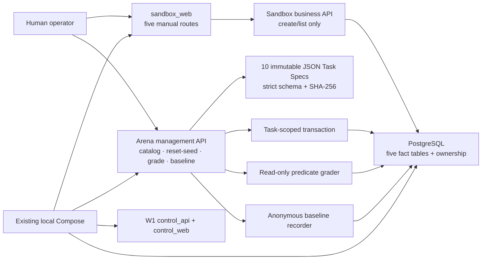
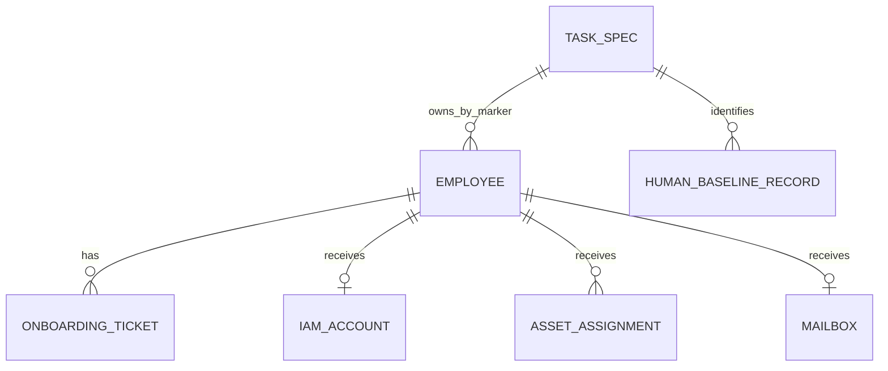

# Architecture

## W3 current-state architecture

W3 preserves the W1 stateless control paths and W2 five-module manual Sandbox.
Arena management is a distinct package and API router inside the single
Sandbox backend deployment; sharing a process does not merge its management
contract with the five business-module endpoints.

| Boundary | W3 responsibility | W3 does not contain |
|---|---|---|
| `apps/control_api` | Preserve W1 `/healthz` | Arena, database, models, external calls |
| `apps/control_web` | Preserve W1 static page | Sandbox or Arena behaviour |
| Five business APIs | Preserve manual W2 creation/listing; inherit ownership from employee | Reset, grade, arbitrary ownership input |
| `/api/arena` | Catalog/detail, fixed task Reset/Seed, grade, baseline record | SQL/table/path input, browser action, benchmark run |
| Task resources | Versioned instructions, structured facts/predicates, checksum | Run results, selectors, prompts, model/browser configuration |
| PostgreSQL | Synthetic facts, task markers, baseline records | Control-plane or real enterprise state |

## Task Spec and catalog

Each task is a strict JSON resource validated into frozen Pydantic models.
Unknown fields are rejected. The task contains prose for the human separately
from structured expected state and an ordered enumerated predicate list. The
grader never parses prose.

Canonical JSON uses sorted keys, UTF-8, and compact separators, excluding only
the `canonical_checksum` field. The SHA-256 digest is stored in and verified
against each spec. A catalog digest covers the sorted task/checksum pairs.
Duplicate IDs, missing fixed tasks, broken fixture/target references, invalid
split allocation, deliverable email domains, non-task asset namespaces,
unsupported predicates, and weights that do not total 100 fail catalog load.

The ten W3 tasks are fixed joiner tasks: six Development, two Validation, and
two Reporting. They do not represent the final roadmap dataset. Reporting
content and checksums freeze on first W3 commit and are not tuned before W15.

## Task-owned data and transaction

The W3 migration adds a nullable `arena_task_id` index to all five fact tables.
Null preserves W2/manual records. A task seed creates one target and one decoy
employee with fixed IDs, values, dates, and timestamps. Business records created
for either employee inherit its marker without accepting marker input from the
caller.

Reset/Seed accepts only a known `task_id`. In one transaction it deletes Mail,
Asset, IAM, ITSM, and HRIS rows whose marker exactly matches that ID, then adds
the fixed initial employees. It never accepts a table, query, fixture payload,
path, or command. Stable ordered fact summaries and checksums make repeated
initial states observable.

## Deterministic grading

The grader receives a validated spec and a SQLAlchemy session, issues ordered
read queries, and evaluates only the frozen predicate kinds. It checks target
employee facts; exact ticket/IAM/asset/mailbox links; ordinary IAM role; wrong
associations; and task-owned duplicates. Results contain integer score,
pass/fail, and ordered per-predicate facts. Only 100 passes.

No grader path flushes, commits, mutates, calls a page/browser/log/model/network,
or infers expected state from prose. Equal spec and database facts serialize to
equal results.

## Manual baseline boundary

The baseline API stores a synthetic record ID, catalog task ID, constrained
`anon-...` alias, offset-aware start/end timestamps, derived duration, manual
action count, optional synthetic notes, and the current grader-derived score.
It records no identity, keyboard input, screenshot, page state, selector,
extension data, or browser telemetry and cannot operate a browser.

## Runtime and migration

The new `20260726_0002` migration follows the released W2 head; the W2 migration
is unchanged. The existing Sandbox API startup still upgrades to Alembic head.
Compose requires no new service: both W1 services, PostgreSQL, Sandbox API, and
Sandbox web remain the complete local topology. PostgreSQL runtime migration
and drift checks remain mandatory; SQLite is test-only.

See [adr/0003-w3-embedded-task-owned-arena.md](adr/0003-w3-embedded-task-owned-arena.md).
