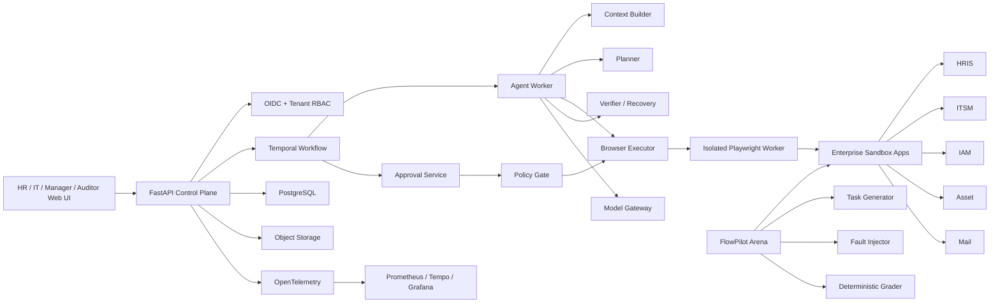

# FlowPilot Arena — Production-Grade Enterprise Computer-Use Agent

> 面向企业 Web 软件的可验证、可恢复、带人机审批的多模态 Computer-Use Agent。

## 1. 项目概述

项目周期按 **16 周、每周 18～22 小时**设计。若每周只能投入 8～10 小时，应延长到约 24 周，不建议压缩功能和验证质量。

项目由两部分组成：

1. **FlowPilot Control Plane**

   可上线的多用户 Agent 系统，负责身份、任务、浏览器执行、审批、记忆、审计、可观测性和并发调度。

2. **FlowPilot Arena**

   可重置的企业应用仿真环境，负责任务生成、页面扰动、故障注入和确定性评分。

Arena 是评测设施，不是产品本身。

参考业务包：

> **Joiner / Mover / Leaver：员工入职、转岗、离职流程**

## 2. 业务闭环

### 2.1 入职流程

```text
HR 提交入职材料
→ Agent 读取表单、邮件和 PDF
→ 发现缺失或冲突信息
→ 根据部门、岗位、地点生成计划
→ 创建 ITSM 入职工单
→ 申请电脑和办公设备
→ 创建 IAM 账号及权限申请
→ 等待经理和安全审批
→ 配置邮箱、群组和业务应用
→ 发送入职通知
→ 验证所有系统最终状态
→ 生成审计报告
→ 关闭任务
```

### 2.2 转岗流程

```text
读取转岗通知
→ 比较原岗位与新岗位权限
→ 生成新增、保留、撤销权限清单
→ 检查职责冲突
→ 等待经理和安全审批
→ 更新部门、设备和系统权限
→ 验证旧权限已撤销、新权限已生效
→ 归档审计证据
```

### 2.3 离职流程

```text
确认身份和离职日期
→ 查询资产、账号、权限和未完成任务
→ 生成回收计划
→ 等待经理/安全审批
→ 撤销权限
→ 转移文件所有权
→ 回收资产
→ 设置邮箱策略
→ 验证账号和权限状态
→ 生成离职审计包
```

## 3. 非目标

v1.0 明确不做：

- 接入真实企业生产系统
- 任意 Shell 或系统命令执行
- Agent 自主删除数据
- 薪酬、银行、法律合同处理
- 自由聊天式多 Agent
- 复杂低代码工作流编辑器
- 训练基础模型
- 为了技术栈数量加入 Kafka、Neo4j 等非必要组件

## 4. 系统架构



## 5. 技术栈

| 模块 | 选择 |
|---|---|
| 后端 | Python 3.12、FastAPI、Pydantic |
| ORM/Migration | SQLAlchemy、Alembic |
| 前端 | TypeScript、React、Vite |
| 浏览器执行 | Playwright |
| 持久工作流 | Temporal |
| 数据库 | PostgreSQL |
| 文件与截图 | MinIO 或 S3-compatible storage |
| 身份 | OIDC；本地部署可用 Keycloak |
| Agent 模型 | OpenAI-compatible provider adapter |
| 可观测性 | OpenTelemetry、Prometheus、Tempo、Grafana |
| 测试 | pytest、Playwright Test、Locust/k6 |
| 部署 | Docker Compose；v1.0 增加 Helm |
| CI/CD | GitHub Actions |
| 依赖管理 | `uv` + 锁文件；前端使用固定 lockfile |

不要把 Temporal Workflow 直接写成不确定的 LLM loop。LLM、浏览器和工具调用全部放在 Activity 中，Workflow 只保存确定性的业务状态和恢复逻辑。

## 6. Agent 核心设计

### 6.1 状态机

```text
RECEIVED
→ CONTEXT_READY
→ PLAN_READY
→ EXECUTING
→ WAITING_APPROVAL
→ VERIFYING
→ COMPLETED / RECOVERING / ESCALATED / FAILED
```

### 6.2 动态计划

计划不是固定提示词，而是类型化 DAG：

```text
Step
- step_id
- objective
- dependencies
- expected_page
- required_context
- allowed_actions
- preconditions
- postconditions
- risk_level
- retry_policy
- fallback
```

业务状态机固定安全边界，Agent 在边界内动态决定页面、顺序和工具。

### 6.3 浏览器观察

每一步可以获得：

- 当前 URL
- 页面标题
- Accessibility Tree
- 过滤后的 DOM
- 当前截图
- 可交互元素列表
- 最近动作和结果
- 页面错误、弹窗和网络状态

实现三条实验路径：

- DOM-only
- Vision-only
- DOM + Vision Hybrid

Hybrid Router 根据页面类型、DOM 质量、历史成功率和成本决定使用哪种观察。

### 6.4 动作空间

只允许类型化动作：

- `navigate`
- `click`
- `type`
- `select`
- `upload`
- `read`
- `scroll`
- `wait`
- `request_approval`
- `verify_state`
- `finish`
- `escalate`

不能让模型拼接 Playwright 或 JavaScript 代码执行。

### 6.5 失败恢复

按顺序处理：

```text
短暂重试
→ 更新页面观察
→ 更换定位方式
→ DOM 切换 Vision
→ 局部重新规划
→ 恢复到最近 Checkpoint
→ 请求人工处理
→ 安全终止
```

禁止无限重试。每个任务有：

- 最大步骤数
- 最大模型调用数
- Token 上限
- 时间上限
- 成本上限
- 同动作重复上限

### 6.6 结果校验

Agent 不能自行宣称完成。

例如“员工权限创建成功”必须由 Grader/API 检查：

- 用户存在
- 组织和部门正确
- 权限与角色模板一致
- 没有超额权限
- 审批令牌有效
- 审批后参数未改变
- 没有重复副作用
- 审计事件完整

## 7. 分层上下文与记忆

严格分为五层：

1. **任务事实状态**

   来自数据库，是唯一事实源；不由模型总结替代。

2. **当前浏览器工作记忆**

   当前页面、最近动作、局部失败、待完成步骤。

3. **短期会话记忆**

   当前任务中用户补充的信息和未解决问题，定期压缩。

4. **用户与组织长期信息**

   部门、角色、位置、设备偏好、审批链；版本化、可删除、有租户边界。

5. **全局企业知识**

   入职制度、权限矩阵、设备标准和操作手册，带版本、来源和有效期。

Prompt 构建流程：

```text
身份与租户过滤
→ 任务阶段路由
→ 检索相关知识
→ 删除过期和重复内容
→ 权限过滤
→ Token 预算排序
→ 注入来源和信任等级
```

页面、邮件和 PDF 都属于不可信数据，不能把其中的指令当作系统指令。

## 8. 人机审批设计

| 等级 | 示例 | 行为 |
|---|---|---|
| L0 | 查询员工、设备、工单 | 自动 |
| L1 | 创建草稿、生成计划 | 自动，保留审计 |
| L2 | 普通账号和设备申请 | 经理审批 |
| L3 | 管理员权限、权限回收、文件转移 | 经理 + 安全审批 |
| L4 | 删除数据、绕过审计 | 永久禁止 |

审批凭证必须绑定：

- 组织
- 审批人
- 角色
- Task ID
- Step ID
- 动作类型
- 参数哈希
- 有效期
- 一次性 nonce

动作参数变化后旧审批自动失效。

## 9. Arena 设计

### 9.1 企业仿真应用

为控制工程量，采用一个仓库和一个后台，但暴露为五个独立站点或子域：

- HRIS
- ITSM
- IAM
- Asset
- Mail

每个应用拥有独立权限、页面布局和数据库实体，但不需要拆成五套微服务。

### 9.2 任务规模

建议 v1.0：

- 12 个入职模板
- 8 个转岗模板
- 10 个离职模板
- 每个模板生成 3 个数据/UI 变体
- 总计约 90 个任务实例

任务变化包括：

- 不同部门、地点和岗位
- 不同字段顺序
- 不同页面主题
- 缺失信息
- 矛盾信息
- 已存在账号
- 部分步骤已完成
- 弹窗和分页
- 登录过期
- 工具超时
- 恶意页面指令

### 9.3 数据集切分

按任务模板切分，而不是随机切分实例：

- Development：18 个模板
- Validation：6 个模板
- Reporting：6 个模板

Reporting 配置在第 3 周冻结哈希，第 15 周前不得根据结果调参。

## 10. 评测体系

[BrowserGym](https://github.com/ServiceNow/BrowserGym) 当前统一支持 WebArena、WebArena Verified、VisualWebArena、WorkArena、AssistantBench 等多个环境；[AgentLab](https://github.com/ServiceNow/AgentLab) 还提供了可复现实验管理。

外部评测不应成为项目阻塞项：

- 首选 WorkArena 子集。
- 若实例访问受限，切换到可复现的 WebArena-Verified 或 MiniWoB/VisualWebArena 子集。
- 自建 JML Arena 始终是完整业务闭环的主评测。

### 10.1 基线

必须保留：

1. DOM ReAct
2. Vision-only ReAct
3. Hybrid，无恢复
4. Hybrid + Planner
5. Full system

### 10.2 消融

- 去掉 Vision Router
- 去掉 Verifier
- 去掉 Checkpoint
- 去掉短期记忆
- 去掉企业知识检索
- 去掉局部重规划

安全模块不能在真实写操作上关闭；安全消融只能在隔离 Arena 中运行。

### 10.3 核心指标

Agent 指标：

- 端到端成功率
- 子目标完成率
- 错误动作率
- 平均步骤数
- 计划修改次数
- 人工接管率
- 故障恢复率

系统指标：

- API p50/p95/p99
- 队列等待时间
- 并发浏览器任务数
- Worker 崩溃恢复
- 数据库锁冲突
- 重复副作用

成本指标：

- 每任务模型调用数
- 输入/输出 Token
- VLM 调用比例
- Cache 命中率
- 单任务成本
- 成功率—成本 Pareto 曲线

安全指标：

- 跨租户读取
- 审批绕过
- Prompt Injection 成功
- 越权操作
- 敏感信息泄漏
- 重复外部操作

## 11. 预注册目标

以下为目标，不是提前宣称的结果：

- Full system 相比 DOM ReAct 基线，Reporting 成功率提高至少 15 个百分点。
- 简单单应用任务成功率 ≥85%。
- 多应用长任务成功率 ≥65%。
- 瞬时故障恢复率 ≥90%。
- 审批绕过：0。
- 跨租户数据泄漏：0。
- 重复业务副作用：0。
- 任务及审批审计覆盖率：100%。
- 后端分支覆盖率 ≥85%。
- 50 个并发 API 用户下控制面稳定。
- 推荐硬件下支持至少 4 个并发浏览器任务。
- 除 LLM/浏览器时间外，控制面 API p95 <500ms。

业务效果只在受控实验中报告：

- 人工基线至少完成 15 个任务。
- 目标中位处理时间下降 ≥40%。
- 目标人工点击数下降 ≥50%。
- 不声称真实企业 ROI。

## 12. 16 周执行计划

| 周 | 主要任务 | 周末验收 | Git 标签 |
|---|---|---|---|
| W1 | PRD、非目标、架构、威胁模型、评测协议、仓库骨架、CI、License | 空系统可启动，CI 全绿 | `w01-foundation` |
| W2 | 企业 Sandbox 数据模型；HRIS/ITSM/IAM/Asset/Mail 基础页面 | 能手工完成一个入职流程 | `w02-sandbox` |
| W3 | Arena Task Spec、Reset、Seed、确定性 Grader；人工基线工具 | 10 个任务可重置和评分 | `w03-arena` |
| W4 | Playwright 隔离 Worker、DOM/Accessibility 观察、类型化动作、DOM ReAct | Agent 完成 5 个简单任务 | `w04-dom-agent` |
| W5 | 截图、OCR/VLM、元素 Grounding、Vision-only 基线 | 视觉任务可运行并记录成本 | `w05-vision` |
| W6 | DOM/Vision Router、观察压缩、动作校验 | 三条基线能配对运行 | `w06-hybrid` |
| W7 | 动态计划 DAG、工具匹配、预算、Verifier、JML 完整任务 | 30 个模板冻结 | `w07-planning` |
| W8 | Temporal Checkpoint、恢复、幂等、故障注入、局部重规划 | Worker/浏览器崩溃后恢复 | `w08-recovery` |
| W9 | 五层上下文、知识检索、短期摘要、组织记忆 | Context 消融可运行 | `w09-context` |
| W10 | OIDC、组织/用户/RBAC、租户隔离、乐观锁 | 跨组织访问测试全部拒绝 | `w10-identity` |
| W11 | HITL、风险策略、一次性审批、审计链 | 所有 L2/L3 操作必须审批 | `w11-approval` |
| W12 | API/Worker 分离、背压、限流、负载测试、Compose 完整部署 | 50 API 用户、4 浏览器任务稳定 | `w12-production` |
| W13 | OTel Trace、成本、Dashboard、失败分类和回放 | 单任务可完整追踪和复盘 | `w13-observability` |
| W14 | Prompt Injection、恶意页面、越权、secret redaction、浏览器沙箱 | 安全套件和威胁模型闭环 | `w14-security` |
| W15 | 外部 Benchmark、三次重复、消融、Reporting 终测 | 生成冻结评测报告 | `w15-evaluation` |
| W16 | 云端 Demo、Helm、双语 README、视频、文档、SBOM、v1.0 Release | 陌生人可复现，仓库公开 | `v1.0.0` |

阶段版本：

- W4：`v0.1.0`，DOM Agent
- W8：`v0.2.0`，Hybrid + Recovery
- W12：`v0.3.0`，Production Control Plane
- W16：`v1.0.0`

## 13. 每周 GitHub 推送规范

建议从第一周就创建私有 GitHub 仓库，每周推送。W16 完成 secret、License 和数据来源检查后改为公开，全部历史仍然保留。

### 13.1 分支模型

```text
main
week/01-foundation
week/02-sandbox
week/03-arena
...
week/16-release
```

`main` 必须始终可运行，不允许直接开发。

每周流程：

```powershell
git switch main
git pull --ff-only
git switch -c week/01-foundation

# 本周分多次小提交
git add -- <files>
git commit -m "feat: scaffold FlowPilot control plane"

git push -u origin week/01-foundation
```

然后在 GitHub 创建 PR。CI 通过、自审完成后合并，再打周标签：

```powershell
git switch main
git pull --ff-only
git tag -a w01-foundation -m "Week 1: project foundation"
git push origin w01-foundation
```

每周 PR 必须包含：

- 本周任务合同
- 修改文件
- 架构或 ADR
- 测试命令和结果
- 截图或 Trace 证据
- 已知限制
- 下周不解决的事项
- 是否使用付费模型及实际成本

推荐文件：

```text
docs/plans/week-01-foundation.md
docs/evidence/week-01-report.md
docs/adr/0001-*.md
CHANGELOG.md
```

GitHub 配置：

- 保护 `main`
- PR 必须通过 CI
- 禁止 force push
- 启用 Dependabot
- 启用 secret scanning
- 建立 GitHub Project：`Backlog → This Week → In Progress → Review → Done`
- 每周建立独立 Milestone
- W4/W8/W12/W16 创建 GitHub Release

## 14. 推荐仓库结构

```text
flowpilot-arena/
├─ apps/
│  ├─ control_api/
│  ├─ control_web/
│  └─ sandbox_web/
├─ packages/
│  ├─ agent_core/
│  ├─ browser_runtime/
│  ├─ context_engine/
│  ├─ policy/
│  ├─ model_gateway/
│  ├─ observability/
│  └─ schemas/
├─ services/
│  ├─ workflow_worker/
│  ├─ agent_worker/
│  └─ browser_worker/
├─ sandbox/
│  ├─ hris/
│  ├─ itsm/
│  ├─ iam/
│  ├─ assets/
│  ├─ mail/
│  └─ seed/
├─ arena/
│  ├─ tasks/
│  ├─ graders/
│  ├─ faults/
│  ├─ splits/
│  ├─ baselines/
│  └─ reports/
├─ benchmarks/
│  └─ browsergym_adapter/
├─ deploy/
│  ├─ compose/
│  ├─ helm/
│  └─ monitoring/
├─ tests/
│  ├─ unit/
│  ├─ contract/
│  ├─ replay/
│  ├─ integration/
│  ├─ e2e/
│  ├─ security/
│  └─ load/
└─ docs/
   ├─ plans/
   ├─ evidence/
   ├─ adr/
   ├─ architecture.md
   ├─ product-brief.md
   ├─ threat-model.md
   ├─ evaluation-protocol.md
   └─ benchmark-card.md
```

## 15. Definition of Done

每周只有同时满足以下条件才算完成：

- 本周验收标准通过
- 测试和类型检查通过
- `git diff` 完整自审
- 没有调试代码和无关格式化
- 没有 key、`.env`、真实个人数据
- 文档与实现一致
- 评测数据来源和许可有记录
- GitHub Actions 通过
- 周证据报告提交
- PR 合入 `main`
- 周标签推送成功

如果验收未过，不把半成品包装成完成；标签可记为 `w08-partial`，并在报告中说明原因。

## 16. 最终 GitHub 仓库要求

README 首页应在一分钟内说明：

- 解决什么问题
- 为什么需要 Agent
- Agent 如何观察、规划、执行、恢复和验证
- 系统架构
- 五分钟快速启动
- Demo GIF/视频
- 最新 Benchmark
- 安全边界
- 当前已知限制
- 不支持哪些生产操作

必须提供：

- 双语 README
- 架构图
- 一键 Compose 启动
- Demo 账号
- 任务回放
- Grafana 截图
- Benchmark 报告
- 消融报告
- 威胁模型
- 数据与模型卡
- SBOM
- Release Notes
- `CONTRIBUTING.md`
- `SECURITY.md`
- Apache-2.0 或兼容 License

## 17. 最终面试演示

五分钟 Demo：

1. HR 上传一份含缺失字段的入职材料。
2. Agent 发现矛盾并请求补充。
3. Agent 生成跨 HRIS、ITSM、IAM、Asset 的执行计划。
4. 页面布局在执行中发生变化，DOM 定位失败后切换 Vision。
5. Agent 创建普通账号和设备申请。
6. 管理员权限步骤暂停，等待安全审批。
7. 审批后继续执行；中途 Browser Worker 重启。
8. Agent 从 Checkpoint 恢复。
9. Verifier 检查所有系统最终状态。
10. Auditor 查看完整 Trace、成本和审批证据。

这一次演示同时证明多模态、规划、恢复、审批、验证和可观测性。

## 18. 最终简历模板

等真实数据出来后填写：

> 独立设计并实现 FlowPilot Arena 企业级 Computer-Use Agent，支持 DOM/视觉混合感知、跨应用任务规划、持久恢复和高风险人工审批，在 X 项自建 JML 任务及 Y 项外部 BrowserGym 任务上，将端到端成功率由 A% 提升至 B%。

> 构建多租户 Agent Control Plane、隔离 Playwright Worker 和确定性状态 Grader，在 50 并发 API 用户及 4 并发浏览器任务下完成负载验证，实现审批绕过、跨租户访问和重复副作用均为 0。

> 建立 OpenTelemetry Agent Trace 与评测回放体系，量化规划、视觉定位、工具调用、恢复、Token、成本和延迟，并通过配对消融验证 Hybrid Router、Verifier 与 Checkpoint 的实际贡献。

## 19. 时间、资源和风险

建议资源：

- Windows + WSL2/Docker Desktop
- 最低 8 核、16GB；推荐 32GB
- 开发期主要使用 fakes、缓存截图和小任务集
- 付费模型只用于阶段性评测
- 项目总模型预算先限制在约 ¥800～¥1,500，超出必须重新评估
- 最终全量评测单独设硬预算

| 风险 | 控制 |
|---|---|
| 花太多时间开发模拟 ERP | 单一后台、五个模块，不拆微服务 |
| 浏览器测试不稳定 | 固定镜像、显式等待、数据库状态评分 |
| VLM 成本过高 | DOM 优先、缓存观察、路由后再调用视觉 |
| WorkArena 无法访问 | W2 提前探测，及时换 WebArena/MiniWoB |
| 同时维护两个大项目 | 当前项目收尾前只执行 W1～W3 |
| 追求功能数量导致无法完成 | A2A、多 Agent、模型训练全部放到 v1.1 |
| Benchmark 污染 | W3 冻结 Reporting split，W15 才正式运行 |

## 20. 启动原则

下一步只执行 **W1：项目合同、目录、CI、Compose 骨架与 GitHub 仓库**。

不要第一天就写 Agent loop；先把范围、证据规则和每周交付纪律冻结。
