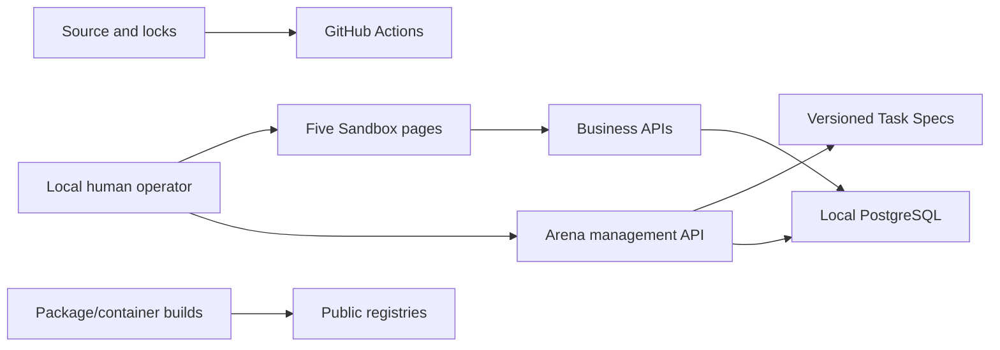

# W3 threat model — Arena Foundation

## Scope and assets

W3 protects the integrity and availability of ten source-controlled synthetic
Task Specs, canonical checksums, task-owned Sandbox facts, deterministic grade
results, and anonymous manual-baseline records. W1/W2 source, locks, migrations,
and local runtime remain assets. There are no real identities, tenants,
credentials, enterprise systems, browser sessions, models, or production data.

## Trust boundaries

The management API is trusted to select only catalog tasks, but its path/body
inputs are untrusted. Task resources are reviewed source, not operator data.
Database ownership markers are the destructive-scope enforcement point. Local
ports and the Compose network are not a production security perimeter.

## Threats and W3 controls

| Threat | W3 impact | Control in W3 | Remaining limitation |
|---|---|---|---|
| Global or arbitrary reset | Destruction of unrelated Sandbox facts | Exact catalog ID; task marker filter; fixed model deletes; one transaction; no table/query input | Unauthenticated local caller may reset any of the ten synthetic tasks |
| Partial reset/seed | Non-replayable state | Transaction rollback; dependency-ordered deletion; fixed seed facts; two-pass tests | Host/database failure testing is W8 |
| Ownership spoofing | Unrelated row deleted or graded | Marker is never accepted in business payloads; downstream row inherits employee marker | Direct database administrators remain outside the app boundary |
| Spec tampering or ambiguity | Invalid grading or split leakage | Strict unknown-field rejection, fixed references/predicates, per-spec and catalog SHA-256 | Review still governs authorized source changes |
| Natural-language grader injection | False success | Grader reads structured expected state/predicate kinds only; prose is never evaluated | Prompt injection testing belongs to W14 |
| Self-reported completion | Inflated result | Grade derives only from DB facts; baseline score is derived by the same grader | Human action counts and notes are self-recorded observations |
| Duplicate/wrong/elevated records | Unsafe false positive | Explicit counts, association checks, ordinary-role predicate, negative tests | W3 is not a production authorization system |
| Grader side effect | State changes during verification | Read-only query implementation; repeated result and before/after state tests | Database read isolation uses the local session defaults |
| Personal/browser data in baseline | Privacy or premature telemetry | Anonymous alias pattern; narrow strict fields; no capture integration | Free-text notes require operator discipline |
| Real data entered in W2 forms | Privacy exposure | `.invalid` validation, `SYN-` assets, synthetic task data and policy | Free-text business fields cannot prove provenance |
| Arbitrary execution input | Host or DB compromise | No SQL, shell, file, selector, URL, task-payload, or command field/endpoint | Local operators retain normal host tooling outside the app |
| Public exposure | Unauthorized mutation | Documented local-only synthetic use | OIDC/RBAC/tenancy wait for W10; never expose publicly |
| Supply-chain or secret leak | Build compromise/credential exposure | Four locks, CI quality gates, Dependabot, Gitleaks | No SBOM/image signing yet |

## Deterministic data-flow rules

- Task facts use only fixed source values, `.invalid` emails, `SYN-W3-...`
  assets, fixed dates/IDs/timestamps, and no random/current-time/network/model
  input.
- Reset deletes only exact ownership-marker matches and returns a stable fact
  checksum. Null-marked W2 records are outside its scope.
- The API rejects arbitrary Reset/Grade bodies and unknown baseline fields.
- Business APIs derive ownership from the employee row. The caller cannot set
  or transfer ownership.
- Grading reads business tables only. It ignores pages, logs, screenshots,
  browser state, baseline notes, and task instructions.
- Baseline records contain no personal identity or browser/keyboard telemetry;
  their score is not caller-supplied.

## Explicitly deferred threats

Browser isolation and malicious pages begin W4/W14; screenshot/model leakage
begins W5; router safety W6; planner/verifier risks W7; workflow recovery and
fault injection W8; memory/knowledge poisoning W9; identity, cross-tenant, and
RBAC W10; approval bypass and audit chain W11; production worker/monitoring/load
risks W12+. W3 makes no control claim for absent components.

## Security operating rules

- Never expose this unauthenticated environment on a public/shared network.
- Never enter or commit real people, accounts, assets, credentials, endpoints,
  or enterprise-derived data.
- Never add a generic reset, arbitrary fixture, SQL, shell, file, or browser
  execution interface under the Arena label.
- Keep Reporting specs/checksums frozen after the first W3 commit.
- Record unavailable scanners honestly; do not weaken CI or acceptance gates.
