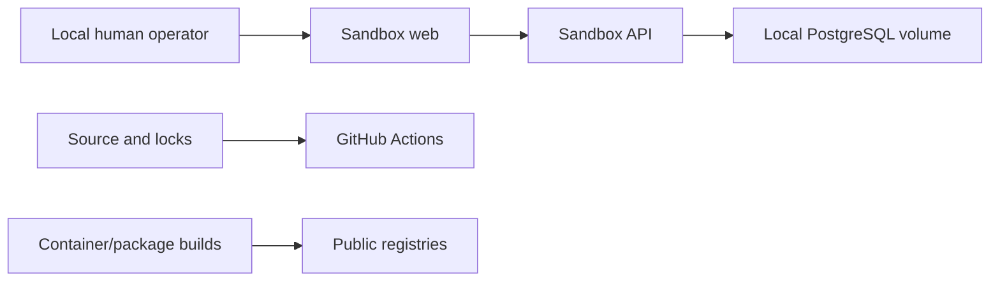

# W2 threat model — Sandbox Foundation

## Scope and assets

W2 adds a local synthetic business-record boundary to the W1 source,
dependency, CI, and static-service assets. Protected assets are the integrity
and availability of the development schema and five synthetic record types.
There are still no real identities, tenants, credentials, enterprise systems,
browser sessions, model inputs, paid model calls, or production claims.

## Trust boundaries

The browser/API boundary accepts untrusted form input. The API/database
boundary is the persistence enforcement point. Public package and image
registries remain supply-chain boundaries. The Compose network and ports are
development-only, not a security perimeter for production use.

## Threats and W2 controls

| Threat | W2 impact | Control in W2 | Remaining limitation |
|---|---|---|---|
| Real or personal data entered | Privacy exposure in source or local DB | `.invalid` email validation, `SYN-` asset tags, fictional manual recipe, no fixture dump | Free-text names/titles cannot prove synthetic origin; operators must follow policy |
| Invalid cross-module reference | Incoherent onboarding state | Foreign keys and API 404 before downstream creation | No workflow transaction spans all five manual steps |
| Duplicate business record | Ambiguous final state | Database uniqueness plus API 409 handling | No update/reconciliation flow in W2 |
| SQL injection | Data disclosure or corruption | SQLAlchemy parameterized statements; no raw SQL from input | No auth or rate limiting; service is local-only |
| Unauthorized local access | Anyone reaching ports can create/list data | Only synthetic data is permitted; documented local-only use | OIDC/RBAC/tenancy are W10 and the service must not be exposed publicly |
| Destructive request | Loss of development state | No update/delete/reset endpoint; restrictive foreign keys | Operators can explicitly discard the Docker volume outside the app |
| Credential reuse | Local public credential treated as secret | Clearly named `flowpilot_local_only`; no external value; documented prohibition | Compose credential provides no protection against a local attacker |
| Dependency compromise/vulnerability | Build or browser compromise | Four committed locks, CI checks, Dependabot for all apps, npm audit during acceptance | No SBOM or production image signing in W2 |
| Secret committed to history | Credential exposure | Existing ignore/pre-commit rules and CI Gitleaks remain | Hosted push protection depends on repository settings |
| Premature automation | Unsafe scope and misleading evaluation | Exact W2 allowlist and explicit W3+ prohibitions | Contract enforcement remains review/process based |

## Data-flow rules

- The API accepts only non-deliverable `.invalid` email domains and synthetic
  asset tags matching `SYN-...`.
- Status and role values are closed W2 literals; no administrative role can be
  created through the W2 API.
- The web calls only the same-origin `/api` proxy. There are no analytics,
  model, external enterprise, mail-delivery, or other outbound integrations.
- The fixed development recipe is documentation only. It is not a reusable
  task seed and exposes no reset or grading endpoint.

## Explicitly deferred threats

Cross-tenant access, OIDC/RBAC enforcement, approval bypass, prompt injection,
browser isolation, model data leakage, deterministic reset/grading, task replay,
worker recovery, and external side effects belong to later milestones. W2 does
not claim controls for components it does not implement.

## Security operating rules

- Never expose this unauthenticated W2 Sandbox on a public or shared network.
- Never enter or commit real people, accounts, assets, credentials, private
  endpoints, or enterprise-derived data.
- Do not reinterpret the local-only database value as a deployable password.
- Record unavailable scanners honestly; do not weaken CI or validation gates.
