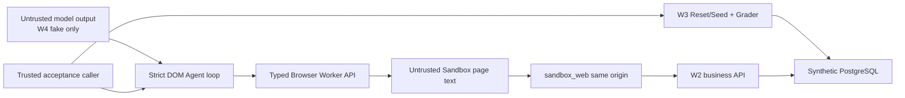

# W4 threat model — DOM Agent Foundation

## Scope and assets

W4 protects the W1-W3 source and locks; ten immutable synthetic Task Specs and
checksums; task-owned Sandbox facts and deterministic grades; Browser Worker
process/session integrity; bounded DOM observations and opaque references;
typed action integrity; and Agent budget/termination integrity. There are no
real identities, credentials, enterprise systems, personal data, screenshots,
visual models, or authorized real-model calls.

## Trust boundaries

Model JSON and page text are untrusted. Browser Worker is a separate process
and container. Docker internal networks, not application naming, enforce that
Worker lacks API/DB routes and Agent lacks all Sandbox routes. The acceptance
caller is trusted W4 test orchestration, not a model tool or production control
plane. Local published W1/W2 ports remain development-only and unauthenticated.

## Threats and W4 controls

| Threat | W4 impact | Control in W4 | Remaining limitation |
|---|---|---|---|
| External navigation / SSRF | Browser reaches arbitrary host | Exact local hostname/origin and five paths; scheme/credential/query rejection; request interception; final URL check; internal network without gateway | W14 performs adversarial page testing |
| Redirect escape | Allowlisted URL redirects outside | Every request is intercepted and every final navigation revalidated | No general proxy or redirect feature exists |
| Arbitrary browser execution | Model runs JS/Playwright/selectors | Strict discriminated actions; extra fields forbidden; no code/selector/options endpoint; opaque refs only | Fixed internal extraction code remains trusted source |
| Shell/SQL/file execution | Host/DB compromise | No corresponding schema, endpoint, dependency, mount, Docker socket, or credential | Local developer host tools are outside service boundary |
| Forged/stale element reference | Wrong element action | Fresh observation nonce; in-memory current map; observation/ref/action match before execution | DOM races after observation can still cause a safe Playwright failure |
| Cross-task browser state | Cookie/form leakage or wrong action | Fresh Browser/Context/Page per session; close on every terminal/error path; no storage return | Crash recovery is W8, not W4 |
| Credential/form leakage | Secret in observation/log | No input values, password data, Cookie/Local Storage, trace, full form dump, or screenshot fields; bounded sanitized messages | W2 free text still requires synthetic-data discipline |
| Prompt injection in page text | Page controls Agent policy | Page text remains tagged untrusted data in model context and cannot create tools/actions without strict validation | Malicious-page dataset/effectiveness evaluation is W14 |
| Input of real/secret data | Privacy exposure | `.invalid` emails, password-control rejection, credential/card/control-character filters, max length | Heuristic filter cannot prove provenance of arbitrary names |
| Resource exhaustion | Host instability | Per-session action/navigation/wait/time limits; Agent step/call/token/cost/time/repetition/no-progress limits; pids/shm/tmpfs bounds | Load/concurrency testing waits for W12 |
| Model self-reported success | False positive | Result has no pass/score; finish means ungraded; independent unchanged W3 Grader; only 100 passes | Real-model five-task run is not yet authorized |
| Direct Agent access to facts/grade | Tuning or bypass | Agent network only reaches Worker; no DB/Arena/business client or credentials | Trusted acceptance caller can manage fixed synthetic tasks |
| Browser container breakout | Host compromise | Non-root user, read-only root, no binds/socket, all caps dropped, no-new-privileges, internal networks | This is development hardening, not a formal sandbox proof |
| Supply-chain drift | Reproducibility/compromise | uv locks, Playwright 1.60.0, Python 3.13.5 tag, observed image IDs, CI, Dependabot, Gitleaks | No SBOM/image signing until later release work |

## Deterministic data and control rules

- W3 task facts/checksums remain fixed; W4 does not write observations, actions,
  model output, or results into specs.
- OS entropy generates session/observation/reference identifiers only. These
  are runtime isolation tokens, not task facts or score inputs.
- Wall-clock budgets use monotonic time. Fake model responses and usage are
  deterministic and cost zero.
- Browser navigation reaches only Sandbox Web. Same-origin business writes are
  caused by typed UI actions, never direct Worker/Agent business API calls.
- Reset/Seed and Grader remain outside the Agent loop. Grade reads database
  facts only and ignores browser/model claims.

## Explicitly deferred threats

Screenshot/model leakage and visual grounding begin W5; DOM/vision routing W6;
planner/verifier risks W7; checkpoint/recovery/fault injection W8; context and
knowledge poisoning W9; identity/cross-tenant/RBAC W10; approval/audit W11;
production worker, monitoring, tracing, and load W12+; malicious-page security
evaluation W14; external benchmarks and Reporting evaluation W15.

## Security operating rules

- Never expose local unauthenticated W1-W3 ports on a public/shared interface.
- Never add a default network, host mount, Docker socket, database/API secret,
  external origin, raw selector, or arbitrary execution parameter to Worker or
  Agent.
- Never enter or commit real identities, accounts, assets, credentials,
  endpoints, form contents, browser traces, or enterprise-derived data.
- Never call a real model before the separate authorization/cost disclosure
  gate.
- Keep W3 Reporting specs/checksums frozen and stop before W5.
