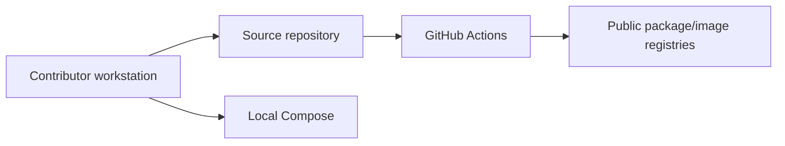

# W1 threat model

## Scope and assets

This is a Foundation threat model, not a claim of production threat coverage.
W1 assets are source code, dependency manifests and locks, CI definitions,
documentation, and the availability/integrity of the static health endpoint
and web page. There is no tenant data, business record, credential, browser
session, external enterprise system, or model input in scope.

## Trust boundaries

Package registries and container registries are external supply-chain
boundaries. GitHub-hosted repository settings are an operational boundary that
must be configured by maintainers rather than encoded in this repository.

## Threats and W1 controls

| Threat | W1 impact | Control in W1 | Remaining limitation |
|---|---|---|---|
| Secret committed to source/history | Credential exposure | Ignore rules, pre-commit private-key hook, CI Gitleaks | Hosted secret scanning/push protection need repository settings |
| Vulnerable or drifting dependency | Reproducibility or supply-chain risk | `uv.lock`, `package-lock.json`, Dependabot, CI installs from locks | No SBOM or dependency-vulnerability gate until later scope authorizes it |
| Unreviewed scope expansion | Unsafe or unverifiable early system | Contract allowlist, AGENTS rules, PR template, evidence report | Enforcement is process-based before branch protection is configured |
| Compromised CI action | Build integrity risk | Minimal third-party actions, explicit workflow review | Full SHA pinning and organization policy require operational governance |
| Exposed local service | Local-only attack surface | API has no data, auth, or side effects; Compose uses explicit ports | Network policies and identity are future milestones |
| Misleading evidence | Incorrect delivery decision | Observed command results required in weekly evidence | Remote CI cannot be claimed before an authorized push |

## Explicitly deferred threats

Prompt injection, cross-tenant access, approval bypass, browser isolation,
model data leakage, task replay, worker recovery, and external side effects
are important roadmap threats. W1 does not implement the components required
to test or mitigate them, and therefore does not claim coverage for them.

## Security operating rules

- Never put a real secret, personal data, private path, or production endpoint
  in code, documentation, test fixtures, images, or evidence.
- Treat a suspected committed credential as active: revoke or rotate it first,
  then report it privately according to [../SECURITY.md](../SECURITY.md).
- Record unavailable local scanners as limitations; do not disable a CI gate to
  make a report look green.
